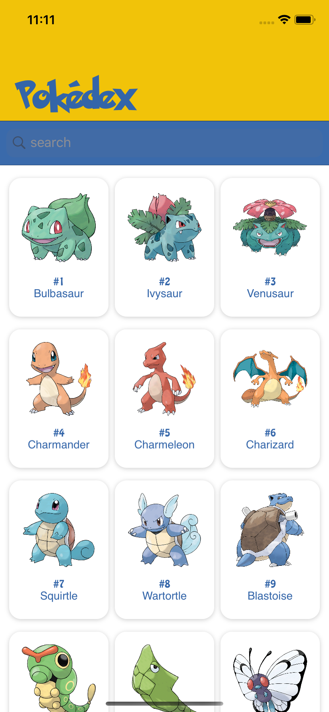
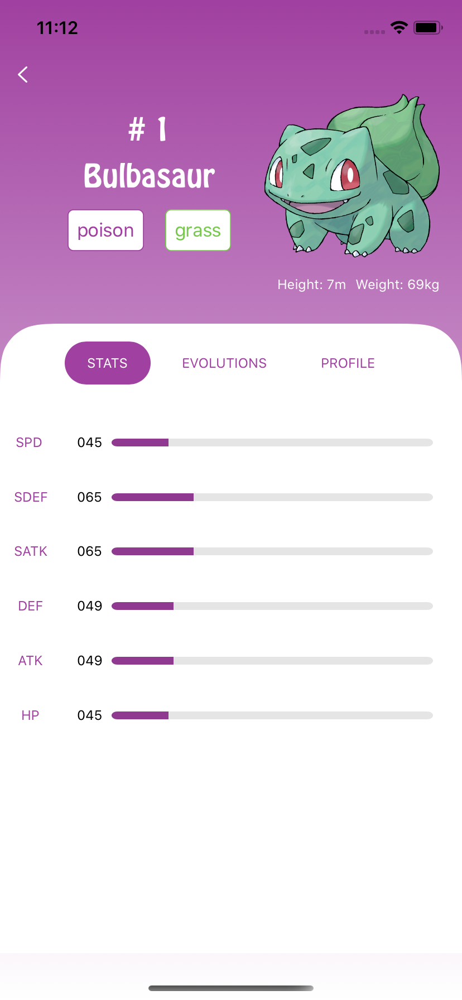
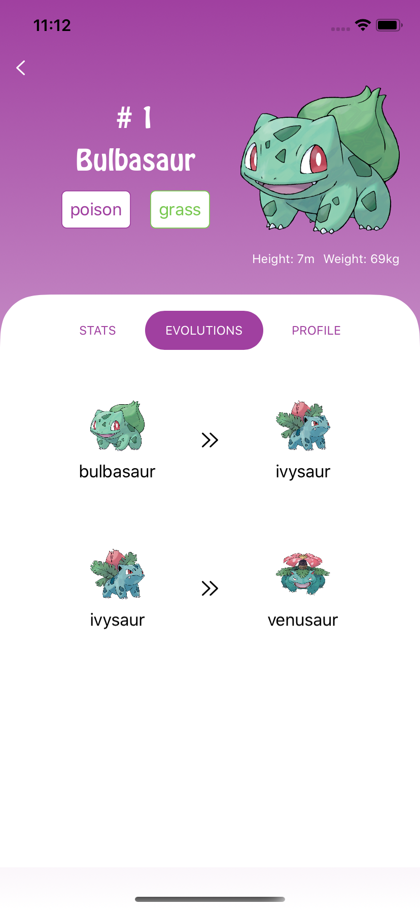
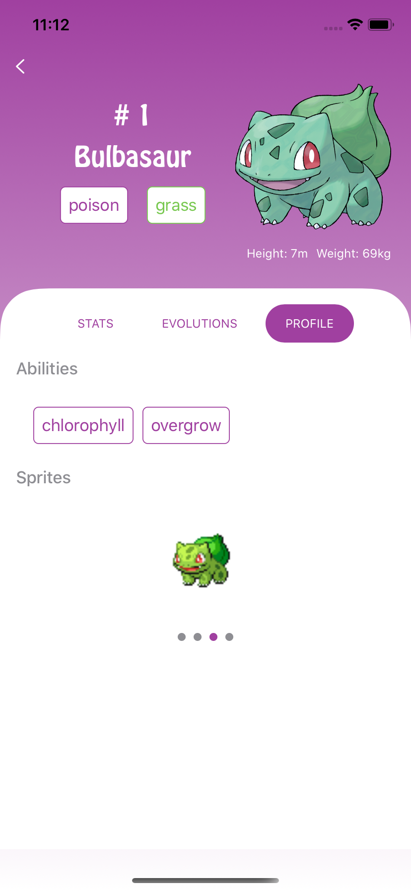
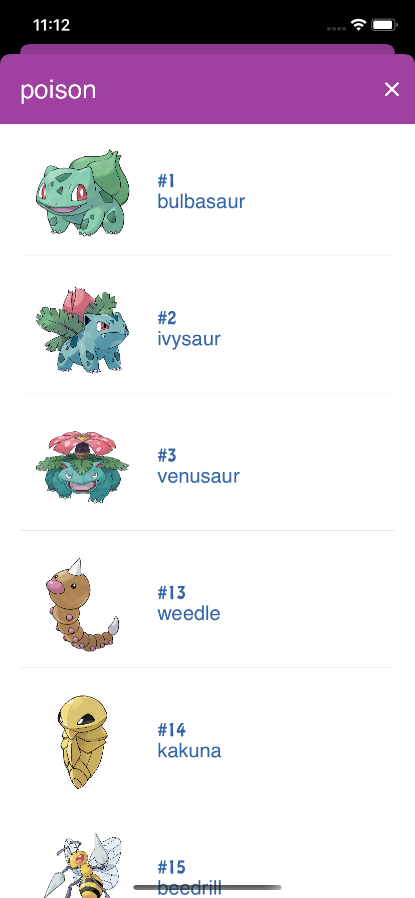
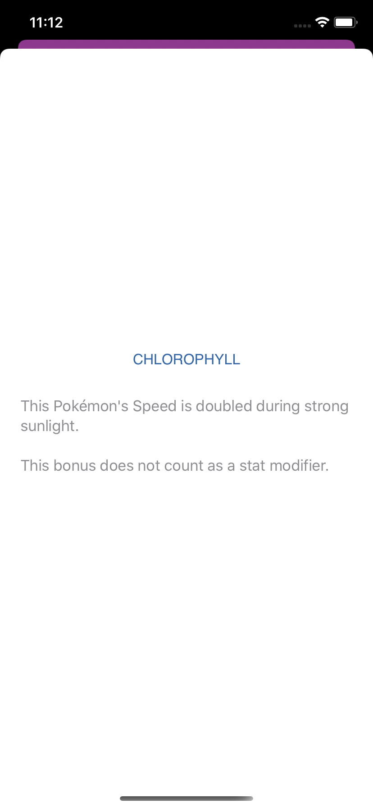

# pokedex

## O Projeto

Arquitetura: **MVVM**

O Projeto foi desenvolvido utilizando o framework SwiftUI que possibilita o desenvolvimento de interfaces de maneira declarativa além de oferecer suporte a visualização do layot em tempo real. O SwiftUI ofeece suporte nativo para implementação do paradigma da programação reativa.

A arquitetura adotada foi o MVVM pois proporciona um baixo acoplamento e favorece a execução de testes. Sua caracteristica principal é a separação de toda regra de negócio da camada de exibição.

A aplicação contempla os seguintes requisitos: 

 - Tela inicial em **Grid** com todos os Pokémons

    - Busca por ID ou Nome
    - Paginação com endless scrolling
    - Foto default do Pokémon na listagem
    
- Tela com os detalhes do Pokémon

    - Nome e ID;
    - Carrossel com as fotos disponíveis do Pokémon
    - View com os stats do Pokémon (hp, attack, defense, special attack, special defense, speed)
    - Exibir suas Habilidades (Run Away, Adaptability, Synchronize etc)
    - Ao tocar em uma habilidade, exibir um modal com a descrição;
    - Exibir seus tipos (electric, ground, water, fire etc);
    - Ao tocar em um tipo, exibir a lista dos Pokémons desse mesmo tipo;
    - Exibir a cadeia de evolução do Pokémon;
   
- Imagens dos personagens via API pública;

 - Testes
    - **Unitários**
    - **Interface** 
    
 - Cache
    - Requisições a API
    - Imagens
    
   Como gerenciador de dependências foi utiizado o Swift Package Manager portanto não há necessidade de se realizar nenhum procedimendo após o checkout do projeto.
   
  
  

    
    
    
    
    
    

